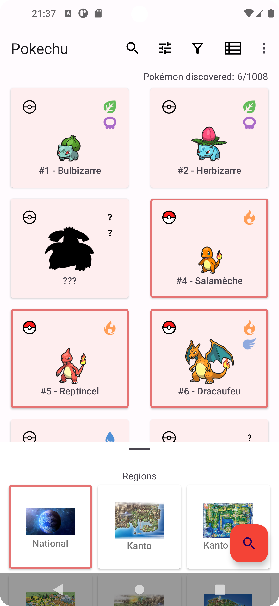

# Pokechu

Yet Another Pokédex App, without spoilers

## Pokémon qui posent problème (fr) :
- [ ] Rocabot et ses évolutions Lougaroc* (formes de jour/nuit/etc.)
- [ ] Axoloto de Paldea et autres variantes locales

## Pokémon with issues (en):
- [ ] Shellos and its Gastrodon evolutions (West/East Sea)
- [ ] Deerling and its Sawsbuck evolutions (Spring/Summer/Autumn/Winter)

## Credits
- GraphView library by the Block brothers [Link][graphview]
- Localization library by Akexorcist [Link][localization]
- Leonids particles library by Platty Soft [Link][particles], updated by Jenna Vassar [Link][particles_update]

[graphview]: https://github.com/oss-bandb/GraphView
[localization]: https://github.com/akexorcist/Localization
[particles]: https://github.com/plattysoft/Leonids
[particles_update]: https://github.com/bigcartel/leonids-android

 
    

