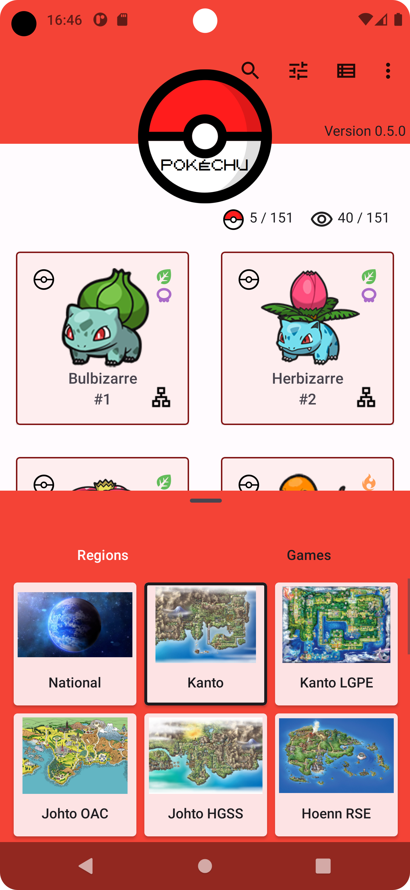
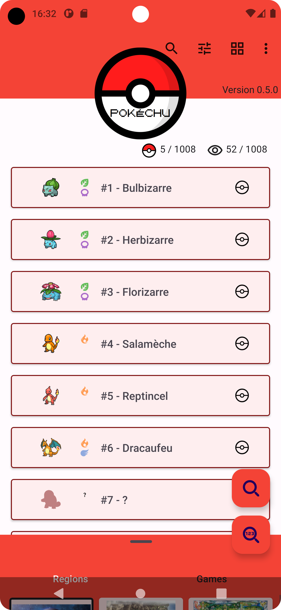
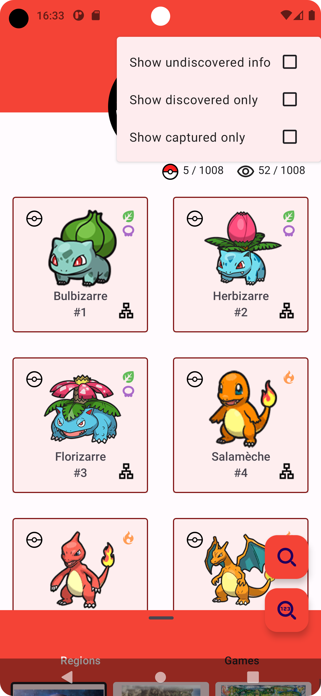

# Pokechu

Yet Another Pokédex App, without spoilers

## Features

Pokémon and stuff

## Todo

Major:

- [X] Filter by games
- [ ] List of games in Pokémon details
- [ ] Add Pokedex official description(s?) in details
- [ ] Add Pokémon cries (trigger on opening details?)
- [ ] Pokémon variants (Alola, mega evolutions, gigamax, etc.)
- [ ] Filter main list by types/etc.

Minor:

- [ ] Merge all data filtering code in viewmodels into single sql queries
- [ ] Find a way to display all searched fields of Pokémon when searching
- [ ] Auto close keyboard when clicking on main list while searching
- [ ] Decrease height of list (not grid) items to make list view actually useful (display more items than grid view)
- [ ] Remove all localized names from db

## Known bugs

- [X] Bottom sheet overlaps bottom (and thus also the end) of main list
- [X] Main activity something refreshes (loading overlay + list transition animation) when coming back from details(/settings?) for no reason
- [X] Captured/discovered count icons not vertically centered
- [ ] "Follow system" theme follows system theme as it was on app launch: https://github.com/Tarik-B/pokechu/issues/1
- [ ] List view holders not fading after turning on "show undiscovered info"
- [ ] Details thumbnail/infos not fading
- [ ] Tree view holders not fading either
- [X] Everything that works

## Development

### Repository hierarchy

| Folder | Content |
| --- | --- |
| assets/ | mostly original svgs of Google icons |
| data_viewer/ | wip json data visualizer (discontinued) |
| parser/ | Pokémon data parser/exporter written in Python 3.10 |
| pokechu/ | Android app written in Kotlin |

### Parser

Just launch main.py. It parses Poképedia pages and PokéAPI data and writes data to output/ folder as follows:

| Output | Content |
| :--- | :--- |
| db.sqlite | sqlite database containing Pokémon, types, evolutions and regions data |
| Kotlin files | one for each enum used in parser/database/app (to keep indexes in sync) |
| images/ folder | downloaded thumbnails of Pokémon, items, etc. (some were manually pre-downloaded) |
| values*/ folders | localized names of Pokémon, items, regions, etc. as Android XML string files |

### Pokechu Android app

Kotlin Android application reading Pokémon data from SQLite database, assets images and XML strings

Copy parser output data as follows:

| Source | Destination |
| :--- | :--- |
| db.sqlite | app/src/main/assets/ |
| Kotlin files | app/src/main/java/fr/amazer/pokechu/enums/ |
| images/ folder | app/src/main/assets/ |
| values*/ folders | app/src/main/res/ |

Code hierarchy:

| Folder | Content |
| :--- | :--- |
| data/ | data repositories classes as per Android MVVM architecture |
| database/ | Room database, entities and daos |
| enums/ | enumerations values for regions, items, etc. generated by Python parser |
| managers/ | managers classes, including shared preferences manager and observer classes |
| ui/ | activities, fragments, etc.
| utils/ | static utilitary functions
| viewmodel/ | MVVM viewmodels classes

## Gallery

| Category | Images |
| :---: | :---: |
| Main Pokemon list: |     |
| Search: |   |
| Details/evolution tree: |   |
| Settings: |  |

## Special thanks

to Poképédia, Bulbapedia and PokéAPI contributors and maintainers!

## Credits
- [GraphView][graphview] library by the Block brothers
- [Localization][localization] library by Akexorcist
- [Leonids][particles] particles library by Platty Soft, [updated][particles_update] by Jenna Vassar
- [LivePreferences][livepreferences] library by İbrahim Süren
- [RecyclerView-FastScroll][fastscroll] library by Tim Malseed
- [CollapsingAvatarToolbarSample][collapsing_toolbar] (FlingBehavior) by Sergey Burlaka
- Pokemon GB font by Jackster Productions

[graphview]: https://github.com/oss-bandb/GraphView
[localization]: https://github.com/akexorcist/Localization
[particles]: https://github.com/plattysoft/Leonids
[particles_update]: https://github.com/bigcartel/leonids-android
[livepreferences]: https://github.com/ibrahimsn98/live-preferences
[fastscroll]: https://github.com/timusus/RecyclerView-FastScroll
[collapsing_toolbar]: https://github.com/SergeyBurlaka/CollapsingAvatarToolbarSample
