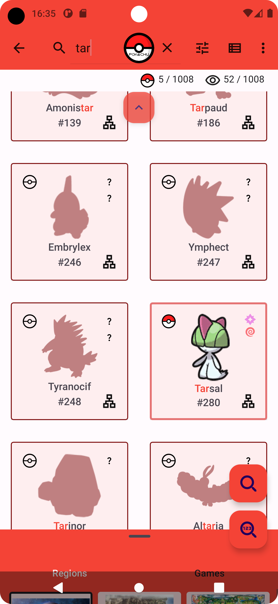
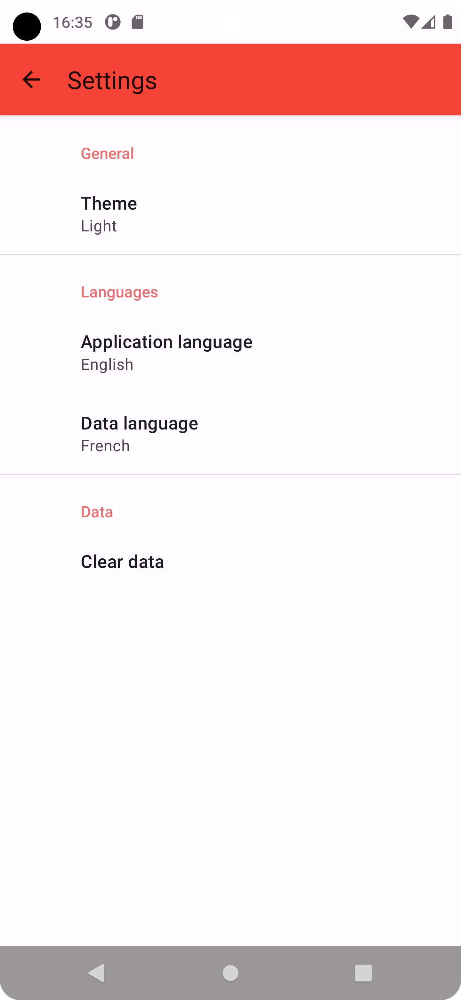

# Pokechu

Yet Another Pokédex App, without spoilers

    

Folders:

- assets/: mostly original svgs of Google icons
- data_viewer/: wip json data visualizer (discontinued)
- parser/: Pokémon data parser/exporter written in Python 3.10
- pokechu/: Android app written in Kotlin

## Parser

Just launch main.py. It parses Poképedia pages and PokéAPI data and writes data to output/ folder:

- db.sqlite: sqlite database containing Pokémon, types, evolutions and regions data
- multiple .kt files, one for each enum used in parser/database/app (to keep indexes in sync)
- images/ folder: downloaded thumbnails of Pokémon, items, etc. (some were manually pre-downloaded)
- values*/ folders: localized names of Pokémon, items, regions, etc. as Android XML string files

## Pokechu Android app

Kotlin Android application reading Pokémon data from SQLite database, assets images and XML strings

Copy parser output data as follows:

- db.sqlite: app/src/main/assets/
- Kotlin files: app/src/main/java/fr/amazer/pokechu/enums/
- images/ folder: app/src/main/assets/
- values*/ folders: app/src/main/res/

Code hierarchy:

- data/: data repositories classes as per Android MVVM architecture
- database/: Room database, entities and daos
- enums/: enumerations values for regions, items, etc. generated by Python parser
- managers/: managers classes, including shared preferences manager and observer classes
- ui/: activities, fragments, etc.
- utils/: static utilitary functions
- viewmodel/: MVVM viewmodels classes

## Gallery

Main Pokemon list:

Search:

Details and evolution tree:

Settings:

## Special thanks

to Poképédia, Bulbapedia and PokéAPI contributors and maintainers!

## Credits
- [GraphView][graphview] library by the Block brothers
- [Localization][localization] library by Akexorcist
- [Leonids][particles] particles library by Platty Soft, [updated][particles_update] by Jenna Vassar
- [LivePreferences][livepreferences] library by İbrahim Süren
- [RecyclerView-FastScroll][fastscroll] library by Tim Malseed

[graphview]: https://github.com/oss-bandb/GraphView
[localization]: https://github.com/akexorcist/Localization
[particles]: https://github.com/plattysoft/Leonids
[particles_update]: https://github.com/bigcartel/leonids-android
[livepreferences]: https://github.com/ibrahimsn98/live-preferences
[fastscroll]: https://github.com/timusus/RecyclerView-FastScroll
